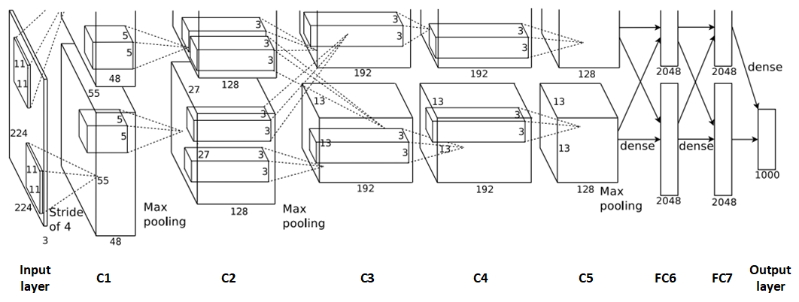

# 手撕 CNN 经典网络系列

CNN 经典网络学习路线！

## [1. LeNet-5](https://github.com/RedstoneWill/ObjectDetectionLearner/tree/main/LeNet-5)

[手撕 CNN 经典网络之 LeNet-5（理论篇）](https://mp.weixin.qq.com/s?__biz=MzIwOTc2MTUyMg==&amp;mid=2247529903&amp;idx=1&amp;sn=7b44c1544a26c5df89539ba10fe0ca6d&amp;chksm=976cd032a01b59248f9bbce8cbc039820c5f8fe882706b92a5f0539d748cd52efc2b1e918ff7&token=431225665&lang=zh_CN#rd)

[手撕 CNN 经典网络之 LeNet-5（MNIST 实战篇）](https://mp.weixin.qq.com/s?__biz=MzIwOTc2MTUyMg==&amp;mid=2247530266&amp;idx=1&amp;sn=7da4a8f0334d3028bbe6b8c020684dd9&amp;chksm=976cd287a01b5b912a20e03c58b09199a8cb4869c09a40320301fc22a494de86fc673475527e&token=431225665&lang=zh_CN#rd)

[手撕 CNN 经典网络之 LeNet-5（CIFAR10 实战篇）](https://mp.weixin.qq.com/s?__biz=MzIwOTc2MTUyMg==&amp;mid=2247530635&amp;idx=2&amp;sn=f68c23e66a7eaf790b2d637f85f2ccc6&amp;chksm=976cdd16a01b5400bd9177f456fb8c156b0211dac781838cd17e0a0b38e6bb66c28c97b01f7c&token=431225665&lang=zh_CN#rd)

[手撕 CNN 经典网络之 LeNet-5（自定义实战篇）](https://mp.weixin.qq.com/s?__biz=MzIwOTc2MTUyMg==&amp;mid=2247531081&amp;idx=2&amp;sn=7265cd037d0bc87182c28c5aef566639&amp;chksm=976cdfd4a01b56c259fcce29d0f4d13a0cba304d81298016db73c543d67981aeed06545e0c8d&token=431225665&lang=zh_CN#rd)

## [2. AlexNet](https://github.com/RedstoneWill/ObjectDetectionLearner/tree/main/AlexNet)

[手撕 CNN 经典网络之 AlexNet（理论篇）](https://mp.weixin.qq.com/s?__biz=MzIwOTc2MTUyMg==&amp;mid=2247532770&amp;idx=1&amp;sn=b45fd0bdbe49426c1a9ffbbb0cb7d341&amp;chksm=976ce57fa01b6c690349f91d633eb678943b29915fd159175b8ead97c982a40b8d0e350e0890&token=1297065527&lang=zh_CN#rd)

## 3. VGGNet

